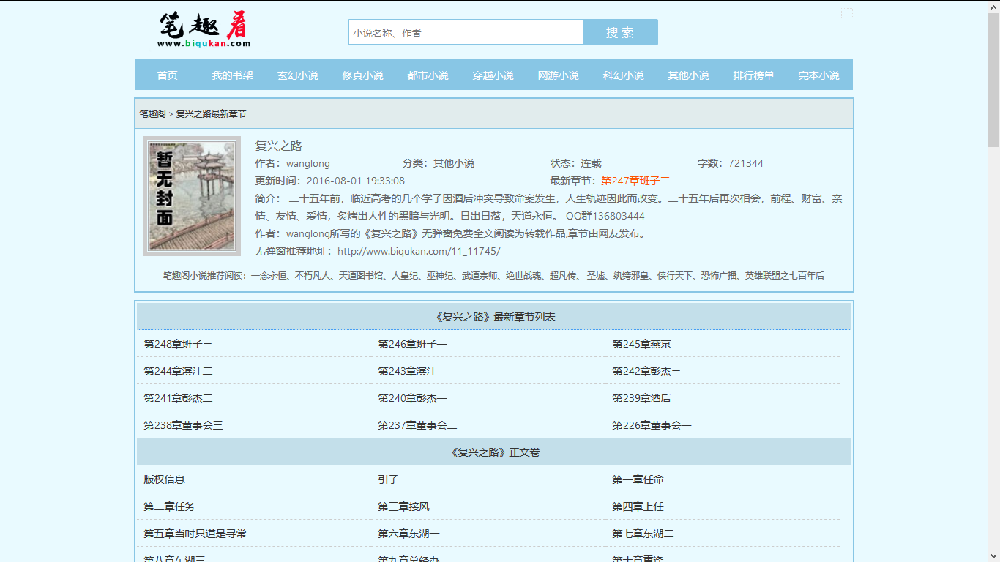
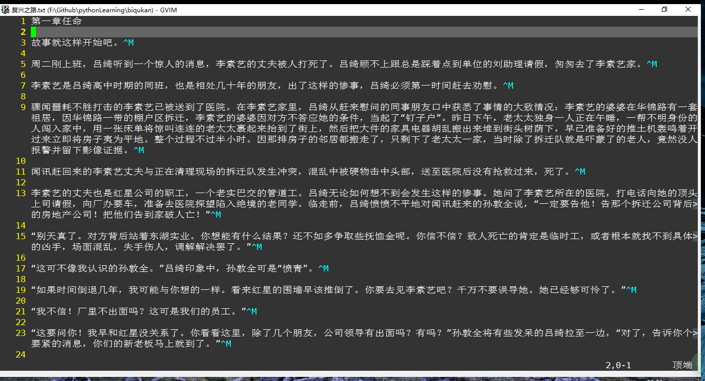

# 下载[笔趣看](http://www.biqukan.com)网站上的小说
- get_novel
## 找到想要下载的小说页面如下
- 

## 获取当前url，写入程序，及写上小说名
    def main():  
        url = 'http://www.biqukan.com/11_11745/'  
        name_novel = '复兴之路'
## 下载完成后自动生成txt文件
- 

