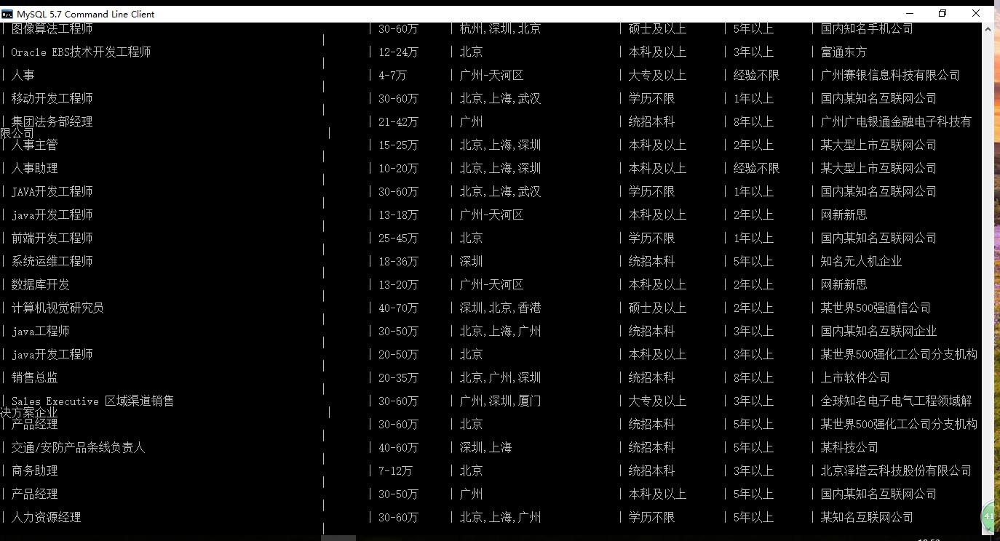
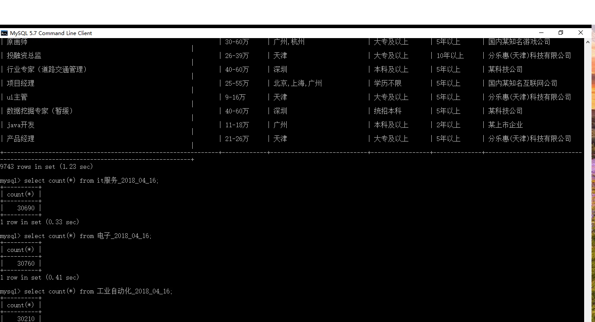
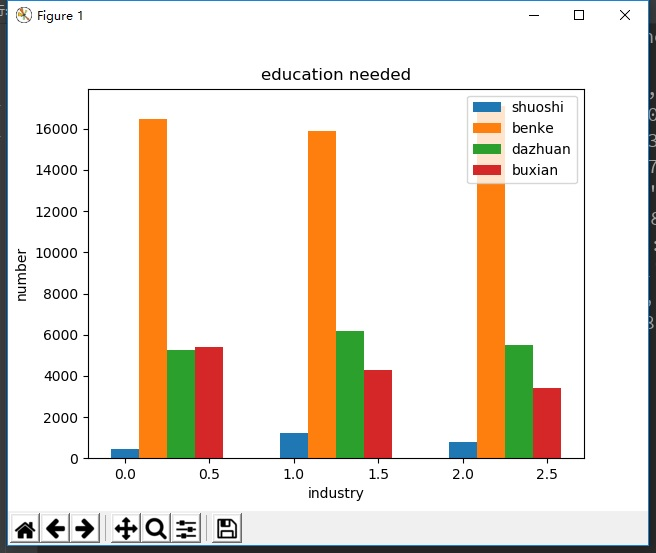
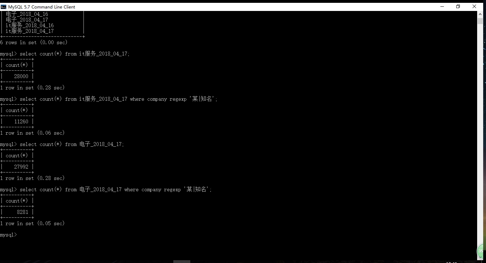

# liepinSpider
爬取猎聘网上招聘信息
# 使用
- 招聘基本信息在city_industry中
- 在其中网页链接中如"https://www.liepin.com/zhaopin/?fromSearchBtn=2&ckid=4828fc4457ebfc22&init=-1&flushckid=1&dqs=010&curPage=0&industries=030&headckid=c1a1d733eabf06fd&d_pageSize=40&siTag=1B2M2Y8AsgTpgAmY7PhCfg%7EJJrjc9QTKuvQj0H6ILUEAw&d_headId=bcb93e044e01e685a5d511135d5d09af&d_ckId=a1d1a8f2941819cc108df8bdf58e73e0&d_sfrom=search_unknown&d_curPage=0"
  - dqs为城市代码，industries为详细行业代码，以及curPage，其他可删除 
- 爬取了有关IT服务，电子，工业自动化的职位
- 

- 

- 分析了招聘信息的学历要求，本科的居多
- 

- 很多公司不公开公司名
- 

