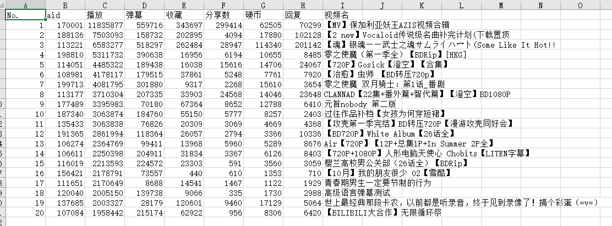
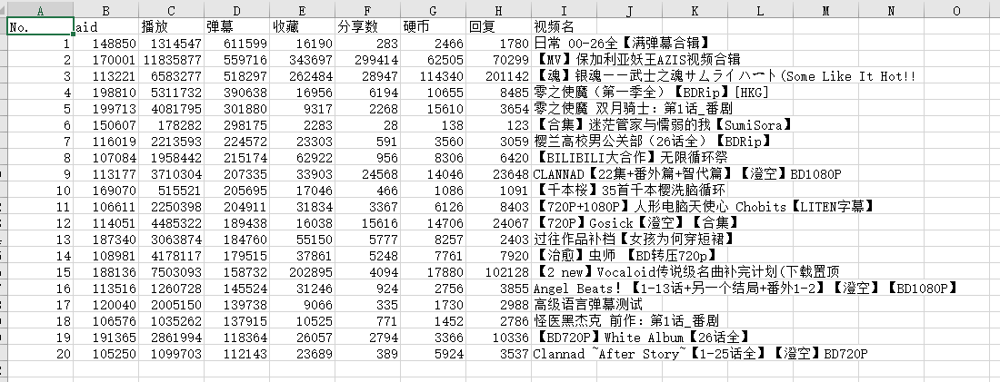

# bilibiliVideoInfo
- 获取bilibili各视频信息，包括播放数，弹幕数，收藏数，分享数，硬币数，评论数
- 根据视频的aid进行爬取
- 使用时将spider/bilibili中aid进行更换
# 使用
- 爬取视频信息时考虑到速度，没有爬取视频名字
- 在read_mysql中，利用mysql对各项进行排名，aid再爬取相应的视频名并保存为文件
- 爬取了aid从100000到200000的视频数据
- 播放数排名前20的资源

- 弹幕数排名前20的资源

