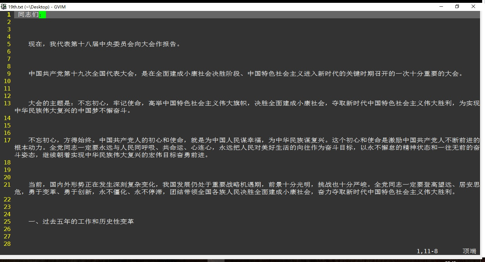
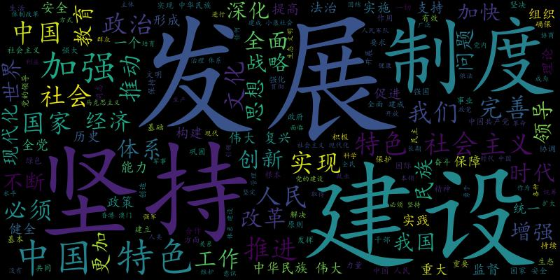
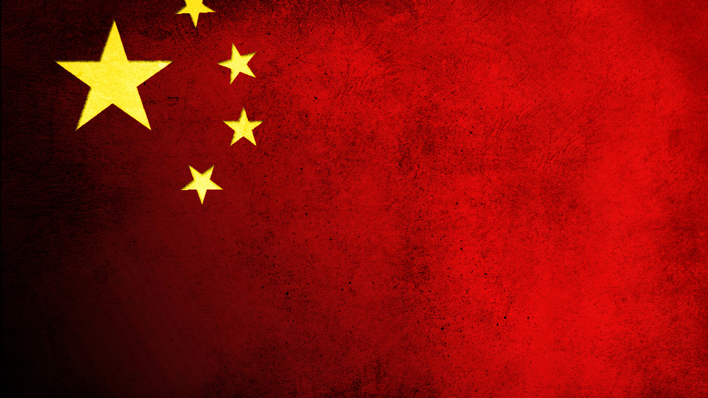
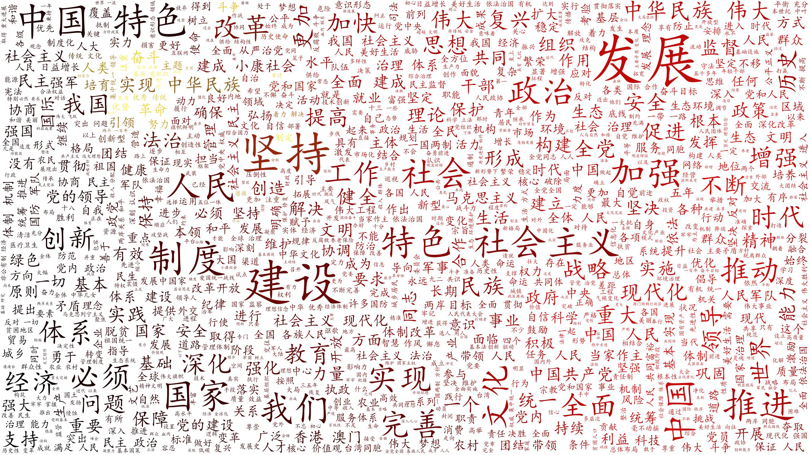

# 19th_CPC_National_Congress
## 十九大全称中国共产党第十九次全国代表大会，在2017年10月在北京召开，详见[百度百科](https://baike.baidu.com/item/%E4%B8%AD%E5%9B%BD%E5%85%B1%E4%BA%A7%E5%85%9A%E7%AC%AC%E5%8D%81%E4%B9%9D%E6%AC%A1%E5%85%A8%E5%9B%BD%E4%BB%A3%E8%A1%A8%E5%A4%A7%E4%BC%9A/1629417) :eyes:
## 19大到现在已经半年多了，都没怎么学习过，正好这次利用学习词云的机会将19大报告做成词云，学习学习 :smile:
- 

## 首先生成词云
## 可以由词云看出十九大，重在发展，坚持各项建设，制度等
## 党的十九大是在全面建成小康社会关键阶段、中国特色社会主义发展关键时期召开的一次十分重要的大会，对鼓舞和动员全党全国各族人民继续推进全面建成小康社会、坚持和发展中国特色社会主义具有重大意义 :raising_hand:
- 

## 其次以国旗为背景模板生成词云
## 当然也可以是其他图片，如果是生成特定形状的云，需要该图片其他地方的颜色是白色的
### 国旗
- 

### 词云
- 

---

## 相信中国会越来越繁荣富强 :heart:
